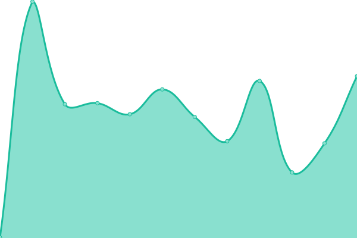

# [📈 Live Status](https://n8n-io.github.io/n8n-cloud-status): <!--live status--> **🟩 All systems operational**

This repository contains the open-source uptime monitor and status page for [n8n cloud](https://n8n.cloud), powered by [Upptime](https://github.com/upptime/upptime).

[**Visit our status page →**](https://n8n-io.github.io/n8n-cloud-status)

[n8n cloud](https://n8n.cloud) is the hosting service for [n8n](https://github.com/n8n-io/n8n). To ensure a maximum of transparency we provide detailed information of our services' statuses. [Issues](https://github.com/n8n-io/n8n-cloud-status/issues) are used as incident reports. To subscribe to our status reports you can watch this repo. If you want to follow specific incidents you can subscribe to the issue itself.

<!--start: status pages-->
<!-- This summary is generated by Upptime (https://github.com/upptime/upptime) -->
<!-- Do not edit this manually, your changes will be overwritten -->
<!-- prettier-ignore -->
| URL | Status | History | Response Time | Uptime |
| --- | ------ | ------- | ------------- | ------ |
|  [n8n.io](https://www.n8n.io) | 🟩 Up | [n8n-io.yml](https://github.com/n8n-io/n8n-cloud-status/commits/HEAD/history/n8n-io.yml) | 

 814ms
     
 | 

<a href="https://n8n-io.github.io/n8n-cloud-status/history/n8n-io">100.00%</a>
    

|  Adminpanel-Backend | 🟩 Up | [adminpanel-backend.yml](https://github.com/n8n-io/n8n-cloud-status/commits/HEAD/history/adminpanel-backend.yml) | 

 1239ms
     
 | 

<a href="https://n8n-io.github.io/n8n-cloud-status/history/adminpanel-backend">100.00%</a>
    

|  [Adminpanel-Frontend](https://app.n8n.cloud/login) | 🟩 Up | [adminpanel-frontend.yml](https://github.com/n8n-io/n8n-cloud-status/commits/HEAD/history/adminpanel-frontend.yml) | 

 1145ms
     
 | 

<a href="https://n8n-io.github.io/n8n-cloud-status/history/adminpanel-frontend">100.00%</a>
    

<!--end: status pages-->

## 📄 License

- Powered by: [Upptime](https://github.com/upptime/upptime)
- Code: [MIT](./LICENSE) © [n8n - Workflow Automation](https://n8n.io)
- Data in the `./history` directory: [Open Database License](https://opendatacommons.org/licenses/odbl/1-0/)
